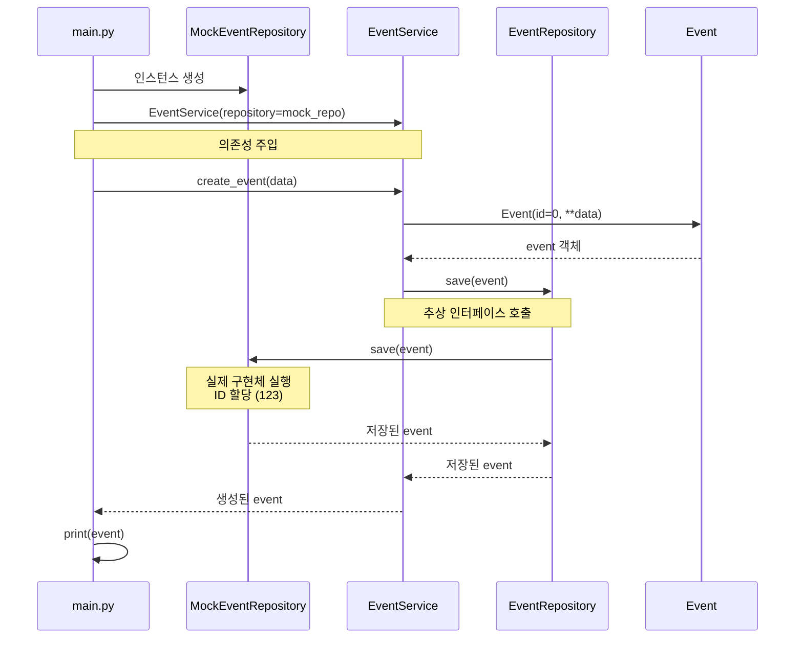

```mermaid
sequenceDiagram
    participant Main as main.py
    participant MockRepo as MockEventRepository
    participant Service as EventService
    participant Repo as EventRepository
    participant Event as Event

    Main->>MockRepo: 인스턴스 생성
    Main->>Service: EventService(repository=mock_repo)
    Note over Main,Service: 의존성 주입

    Main->>Service: create_event(data)

    Service->>Event: Event(id=0, **data)
    Event-->>Service: event 객체

    Service->>Repo: save(event)
    Note over Service,Repo: 추상 인터페이스 호출

    Repo->>MockRepo: save(event)
    Note over MockRepo: 실제 구현체 실행<br/>ID 할당 (123)

    MockRepo-->>Repo: 저장된 event
    Repo-->>Service: 저장된 event
    Service-->>Main: 생성된 event

    Main->>Main: print(event)
```
